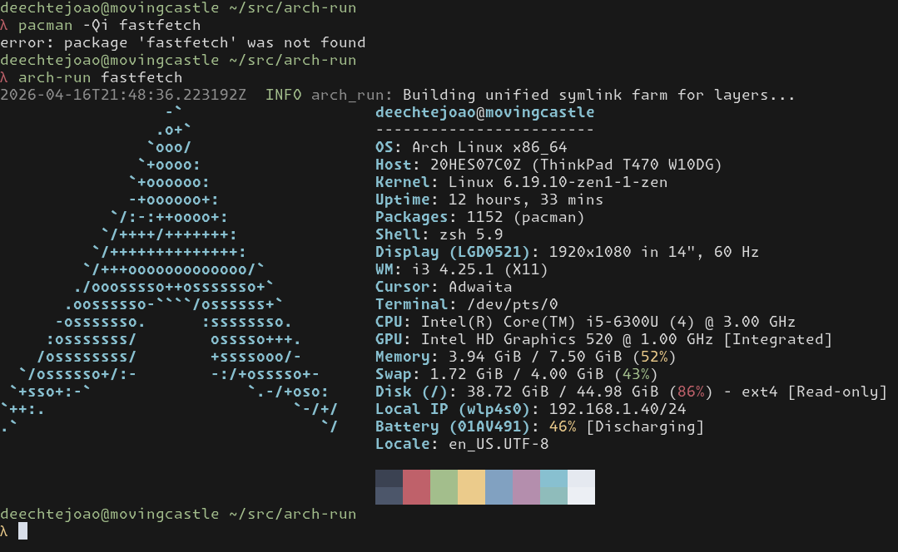

# arch-run

**arch-run** is a command-line utility for executing applications from the Arch Linux package repositories in a sandboxed, ephemeral environment. It allows you to run applications without installing them on your system, similar to `nix run` but specifically for Arch Linux.

 

## What is it?

Have you ever needed to run a command-line tool for a one-off task but didn't want to clutter your system with a permanent installation? `arch-run` solves this problem by:

1.  **Dynamically fetching** the requested package from the Arch Linux repositories.
2.  **Resolving and fetching** all of its dependencies.
3.  **Creating a secure, isolated sandbox** using Bubblewrap.
4.  **Executing your command** inside the sandbox with the package's environment.

Once the command finishes, the sandbox is destroyed, leaving your system clean. The downloaded packages are cached locally, making subsequent runs fast.

## How to use it?

Provide the name of the package you want to run, followed by any arguments you want to pass to it:

```bash
# Run fastfetch 
arch-run fastfetch 

# Run cowsay with an argument
arch-run cowsay -- "Hello from a sandbox!"
```

### Cache Management

`arch-run` maintains a local cache of downloaded packages to speed up future executions. You can manage this cache with the following commands:

```bash
# List all currently cached package layers
arch-run list

# Prune the entire cache
arch-run prune --all
```

## How it works?

`arch-run` performs the following steps to execute your command:

1.  **Dependency Resolution**: It uses `pacman -Sp` to build a dependency graph for the target package without requiring root privileges.
2.  **Concurrent Fetching**: It downloads all required packages concurrently using `tokio` for maximum I/O throughput.
3.  **Cache & Decompression**: Packages are downloaded as `.tar.zst` files, which are then decompressed and extracted into a local cache directory (`~/.cache/arch-run`).
4.  **Symlink Farm**: To create a unified filesystem for the sandbox, it builds a "symlink farm" in a temporary directory. This farm merges the `usr` directories of all package layers into a single, coherent structure.
5.  **Sandboxing**: It uses `bwrap` (Bubblewrap) to create a container. The host's root filesystem is mounted as read-only, and the symlink farm is mounted to provide the application's files. The user's current working directory is also mounted to allow for I/O.
6.  **Execution**: The requested command is executed inside this isolated environment.

This entire process is orchestrated in Rust, with a focus on safety, concurrency, and performance.
